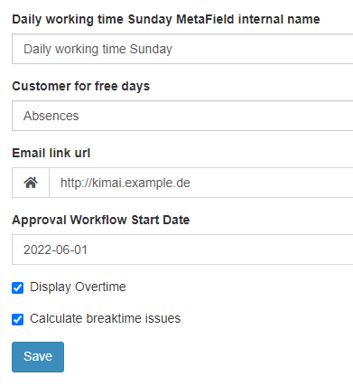

# ApprovalBundle

A plugin for [Kimai](https://www.kimai.org/) - a timetracking open source tool - to approve timesheets of users on a weekly basis including APIs.

Checkout the [Documentation](./documentation.md) for content information and [Troubleshooting](./doc_troubleshooting.md) if you have issues.

Here is a short live demo (for Kimai2 in version 1):


## Version 1 vs. Version 2

This plugin supports two version of Kimai:

- the Plugin as located in the `main` branch, supports the version 2 of Kimai 
- Version 1 support is available in the branch [bundle_for_kimai_v1](https://github.com/KatjaGlassConsulting/ApprovalBundle/tree/bundle_for_kimai_v1). 
- the Plugin for Kimai2 does not support the vacation/holiday bundle, this is only supported for Kimai1 as the bundle is working differently for Kimai1 and Kimai2.

For now new updates will be implemented in Version 1 and then migrated to Version 2 later on - major updates are not expected.

## Requirements

- Required Kimai >= 2.8 (for ApprovalBundle in Version 2.x in branch `main`) 
- Requires Kimai >= 1.16.10 (for ApprovalBundle in Version 1.x in branch `bundle_for_kimai_v1`)

Optional, but recommended:
- [LockdownPerUser plugin](https://github.com/kevinpapst/LockdownPerUserBundle) - without this bundle, the lockdown functionality will not work

Optional, but recommended for version 1:
- MetaFields plugin - optional setting of working hours per day per user unless specified in ApprovalBundle "Settings workday" (in Kimai 2, this is a new standard setting for users, in the old version it can be set as custom fields)


## Features

- Users can send a week for approval (in sequential order)
- User lockdown -> a submitted/approved week can no longer be edited (apart from admins) - there is one lockdown date per user (LockdownPerUserBundle)
- Teamlead/Admin can approve or deny the week
- Overview of approvals, missing approvals and the status
- Mailing options to recall approval tasks if outstanding
- Overview of overtime (for holiday/vacation, this is only working for Kimai 1.x)
- Overview of break issues according German Law

## Status

The approval bundle has been lately updated to support the Kimai version 2.x. 
The active ongoing development and testing is done on Kimai version 1 as this. 

A detailed testing is NOT performed. For this the release is pretty stable, but there might be issues due to different settings, environment etc. 

If you experience anything, please report this in GitHub [issues](https://github.com/KatjaGlassConsulting/ApprovalBundle/issues/new/choose).

## Issues

It is highly recommended to use the **same timezone** setting for all users. Furthermore all users should use the **same "Start day of the week"** setting - everybody should use "Monday". Otherwise issues could appear as, e.g. Monday times can be located on a Sunday when the teamlead and the user using different timezones. Furthermore the "Start day" is used to store the approval week. When the "Start day" is Sunday for a user and Monday for the teamlead, the approval will not work appropriately - an update for this is unlucklily more complex and set to "on-hold".

Please checkout [doc_troubleshooting.md](./doc_troubleshooting.md) for troubleshooting.

## Installation

First unzip the plugin into to your Kimai `plugins` directory:

```bash
unzip ApprovalBundle-x.x.zip -d <kimai path>/var/plugins/
```

And then reload Kimai and install all migrations:

```bash
bin/console kimai:reload
bin/console kimai:bundle:approval:install
```

The plugin should appear now.

## Settings

### Working time setup (optional)

The ApprovalBundle needs the users working-hours configuration to be available in case you want to display overtime. 

- **version 2**: this can be found in each users profile at `Edit > Employment contract`. 

- **Version 1** MetaFields  for users are required.
  - Custom-Fields -> Users
  - The following fields must be from type = "duration", required field, visible, Role = "ROLE_SUPER_ADMIN", default for most should be default = "28800" (which is for 8 hours), for Saturday/Sunday it should be "0" - the names could be anything, but the meaning is according those descriptions
    - Daily working time Monday (daily_working_time_monday)
    - Daily working time Tuesday (daily_working_time_tuesday)
    - Daily working time Wednesday (daily_working_time_wednesday)
    - Daily working time Thursday (daily_working_time_thursday)
    - Daily working time Friday (daily_working_time_friday)
    - Daily working time Saturday (daily_working_time_saturday)
    - Daily working time Sunday (daily_working_time_sunday)

The daily and weekly hours are displayed. For this the daily working time per day needs to be specified per user. Typically, it might be 8h per week day. But there are very different situations, so someone might only work 4 days a week or less hours a day.

If you do not use the "overtime" these settings are not required. But if you do, these values must then be set for every active user. Note that overtime is not supported for Kimai 2 (holiday/vacation are not considered).

Additionally, working hours till an "end date" can be specified directly in the bundle settings. This enables different expected working times for different periods. A user might for example work 8h daily till 15.5.2023, then only 4h daily till 22.08.2023 and then again 8h daily from that day on.

### Remark LockdownBundle

The [LockdownPerUser bundle](https://github.com/kevinpapst/LockdownPerUserBundle) also comes along with some custom user fields. An empty value is not accepted for start of approval timeframe, please enter "0000-01-01 00:00:01" for the three lockdockdown fields. The same you can enter for the other two time-settings. The ApprovalBundle will modify the "Lockdown period end" and the "Lockdown grace period".

### Team Setup

Next the teams needs to be setup. The teams define which person approves the time for what user. It is typically a picture of the organization. The teamlead is reponsible to approve times from it's team members. A teamlead can also be a member of a different team and for this has also an approver. The super user can perform approvals for all. It is expected that the teamlead has also the role of the teamlead - otherwise he/she cannot see the approvals.

### Approval Settings

The final approval settings can be done via `Hours approval > Settings`. A customer for off-days can be set - then break times are not considered for those. The E-Mail link will be used as prefix to have the mails containing the correct links for approval views. You might want to enter something like `https://kimai.example.com/`. The approval week start date defines a date where the approval workflow should start. All prior unapproved weeks are ignored.

Then there are two toggle options available: the `Calculate breaktime issues` can be used to deactivate the calculation of breaktime issues. In Germany, there is a law available that specific break times must be available. For this in the `Approved weeks report` there are red hints when the German worktime rules are not followed, e.g. someone worked 8 hours without an appropriate break. If you are not located in Germany, you can switch it off as this might be irrelevant for you.

The `Display Overtime` options allows to calculate and display expected hours and overtime hours. For example, a colleague is working 40 hours a week. When she is working the concrete week 45 hours, she has 5 hours overtime for that week. The expected hours are to be entered in the `Employment contract` per day and/or in the `Settings workdays`. Remark: if you set all expected working hours to zero, you see the summed up actual working hours. When this option is active, there is also an overview tab for "Overtime" showing the submitted/approved weeks including their times. If you are not interested in "Overtime" at all, then this can be deactivated.



### Role Settings

There are two new roles available for the team approval. The `view_team_approval` ideally should be YES for all but the user. This allows up from the teamlead hierarchy to see the approvals of their team. The `view_all_approval` should either be YES for System-Admin only or for System-Admin and Admin, depending on your schema. 

## Mail

Per default, mails are send to teamleads when a user submits an approval. When someone accepts or rejects an approval, a mail is send to the user. There are two options available in the settings to deactivate this functionality.

Make sure to setup Kimai that mails can be send accordingly. Please see [here](https://www.kimai.org/documentation/emails.html) for instructions how to setup and check.

## Functionality of Lockdown (requires LockdownBundle)

With the lockdown bundle the lockdown periods can be set per user and no longer per system option. For this it is possible that user 1 has a lockdown date as of 01.01.2022 whereas user 2 could have for example a lockdown date of 15.01.2022. Per user - a locktime frame can be defined by "Lockdown period start" and "Lockdown period end". Considering also the "Lockdown grace period" (how long after the locktime end it should still be possible to edit time entries) - this defines which time entries can be modified by the user. Please checkout the general lockdown period documentation [here](https://www.kimai.org/documentation/configurations.html#lockdown-period) for detailed information - the same principle is applied, but "per user".

When a week is submitted for approval, then this or any prior week should be locked - no time modifications for that week should be possible. This timesheet lock must be available per user. The following graphic shows an example.


When "User A" has submitted weeks 1-3 for approval, then this user can submit week 4 next and can not modify any times including week 3 or prior. "User B" is a bit slower with week submission - only submitted week 1 and 2 - and has as current lock date the last day of week 2. For this "User B" is able to create/modify/delete time sheets in week 3 and 4.

To have this functionality available, the ApprovalBundle changes the "Lockdown period end" and "Lockdown grace period". Typically, both values will be set to the last day/second of the approval end date. In case this date is in the future (for example when submitting weeks which are upcoming) - then the end grace is the current day to prohibit any editing for the future.

## APIs

There are various APIs available for the ApprovalBundle. Please check out the API swagger documentation for the various endpoints and their parameters (`<kimai_path>/api/doc`).

Overview of APIs:

- Get next-approval-week
- Get status of selected week (approval open, submitted, approved, rejected)
- Get overtime for specified year
- Get weekly overtime overview for all weeks from provided date and later
- Post a "submit of approval" for a specified week

## Cronjobs

Cronjobs can be setup to activate mailings with respect to outstanding approval processes. The following commands are available:

All commands are run with the command:
`bin/console kimai:bundle:approval:{{ command from table }}`
Command send lists of users (without system-admin and disabled users)

E.g.
`bin/console kimai:bundle:approval:admin-not-submitted-users`


|   Command                             |   Email to:                                                   |   Contents                                                                                                                    |
|---------------------------------------|---------------------------------------------------------------|-------------------------------------------------------------------------------------------------------------------------------|
|   admin-not-submitted-users           |   System-Admin                                                |   List of all users with his 'not submitted' weeks. Command send lists of users (without system-admin and disabled users).    |
|   teamlead-not-submitted-last-week    |   Active team-leaders                                         |   List of team users with his 'not submitted' weeks. Command send lists of users (without system-admin and disabled users).   |
|   user-not-submitted-weeks            |   All active users (without admins and System-Admin)          |   List of weeks that are 'not submitted'.                                                                                     |

## Contribution

Many thanks go to [HMR-IT](https://www.hmr-it.de) which had been highly involved in this project at the beginning.

Additional thanks go to Milo Ivir for additional translations and to Kevin Papst for code enhancements and the update to use this bundle with less pre-requisites.

Many thanks to Kevin Papst, Vitor Mattos and Sam MacLennan for working on the migration of the ApprovalBundle supporting Kimai 2.

Thanks also to Brett Meyer, Kevin Papst and Sam MacLennan for their participation and pull requests.