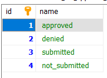

# Troubleshooting

Find here a list of tips you can check if you have issues.

## Database issue

After installation, there should be three tables which had been installed: kimai2_ext_approval_history, kimai2_ext_approval and kimai2_ext_approval_status. The kimai2_ext_approval_status should contain four different entries:

There must not be situations where "status_id" in the table "kimai2_ext_approval_status" is null.

## Reset approval database settings

In case you want to reset/delete all approvals - you can remove all entries from "kimai2_ext_approval_history" and "kimai2_ext_approval". You have to remove the history first due to depending keys.

## Teamleads does not see their teammembers

Please check the teams and the roles.

- Under "System" -> "Teams" a team must be setup accordingly, having the "Teamlead" assigned
- The "Teamlead" must have the corresponding role, "System" -> "Users" -> select the teamlead -> "Roles" -> "Teamlead" must be activated
- The `view_team_approval` must be given rights for teamleads, "System" -> "Roles" -> "Teams" -> "view_team_approval" -> click "yes" for Teamleads

## Workday settings seems to be not working

### Wrong general settings

When the Monday, Tuesday etc. settings are accidently defined to hold the wrong day, for example you accidently assigned the meta field Thursday to the day setting Friday, the calculations will be according these settings. So please check those.

### Wrong settings per user

To check that each user has the correct setting, you can get the overview via "System" -> "Users" -> click the "eye" top right -> select all daily workday fields. Now you can easily see which users have missing the workday setting.

## Lockdown is not working

You might have missed to install the lockdownBundle. Only when this is installed, the lockdown functionality per user is used.