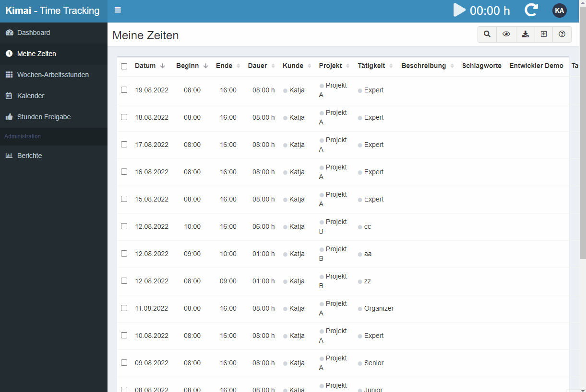
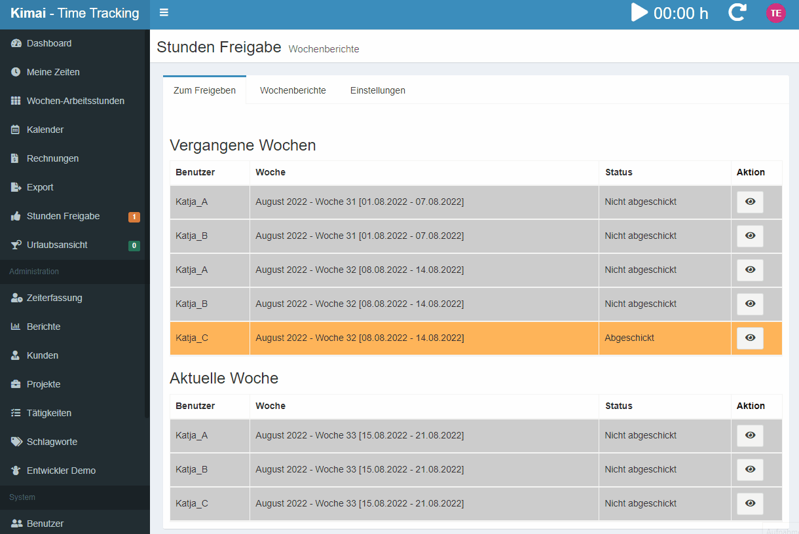
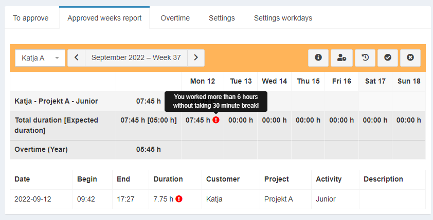
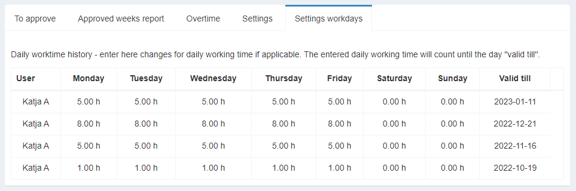

# Approval Bundle

The approval bundle can be used to setup an approval workflow for timesheets in Kimai.

## Users - Submit for Approval

The user can check their weeks and submit the timesheets week-by-week for approval. The user can see additionally the comments entered for the projects, can see the connected single time entries and can also see the history. 

The red information areas show possible issues with German law as it is for example forbidden to work 8h without a break.

The overview also displays the weekly hours a user should work together with the actual hours worked.

## Teamleads - Submit their timesheets and approve team members weeks

The Teamleads can see an overview of their own open weeks additionally to those of their team members open weeks and from the last week a complete overview. The teamlead can approve or deny the timesheets of their teamleads. Once an approval is accepted, the teamlead is not able to "undo" that acceptance.

A teamlead can also be a team member of a different team, then the teamleads week can be approved by that teamlead.

## Admins - Overview & Overrule

The admins can see and update any approval the same way the teamlead could do for their team. Additionally the admin is able to reset an already approved week.

## Lockdown Process (required LockdownBundle)

The "LockdownPeriodPerUser" is used. As an admin you can see the lockdown settings per user. This period should only be updated by the approval bundle and not manually.

When a user sets a week to approval, then the end time of that week is used as lockdown date for this user. For this there cannot be any time entries added for this or any previous week.

When a week which was send to approval is denied (by teamlead or admin) or "undone" (by admin), then this week is opened, the lockdown date is set to the end of the previous week. As this would allow any following week to be updated as well, all weeks that follow that denied/re-opened week are also reset and need a new approval.

## Calculate Breaktime Issues

When the setting is activated, Germany breaktime rules are checked and displayed in the "Approved weeks report". There will be a red exclamation mark where you can see additional information when you go mouse-over. When the corresponding days belong to "Days off", then the issues are not displayed for that day.

The following rules are checked:

- Users must not work more than 6 hours without a 30 minute break
- Users must not work more than 9 hours without a 45 minute break
- Users must not work more than 10 hours a day
- User must rest at least 11 hours between days.

## Overtime display

Per default die Overtime is calculated. For this the "Daily Working Time" is used. There are two areas where the daily working time is entered, there are (when the metaBundle is available), the daily working time meta fields for each user and optionally daily working time entries for a user in the "Settings workdays".

Background: The VacationBundle and other plugins are using the daily working time meta fields. To be consistent, also the approvalBundle is using the same fields. If you do not use these other plugins, you might use the "Settings workdays" only, e.g. enter the daily working time for User X valid until 01.01.2100.

**Calculate expected hours for a week**

To calculate (and store in approvals) - the expected working hour, it is summed up for each working day how much hours that person should work. In general it is assumed that:

- current daily working time is stored in meta fields for user (might be used by other plugins, e.g. VacationPlugin)
- deviations from daily working time, e.g. people switching from 40 hours to 20 hours or similar, are intended to be entered in the "Settings Workday".

**Process**: We assume today is the 15 May 2023 and a colleague is going from a 8h per day week to a 5h per day week. We change today the daily working hours in the "System"->"Users"->"Select the user"->"Edit" the working hours to 5 each day and include a new entry in "Hours approval"->"Settings workdays" for this user using 8 hours for the days and the 30.06.2023 as "valid till". 

This expected hours are calculated that way:

- if there is a "Settings workdays" entry for that user and the day is within this range - use the corresponding hour from there
- if there are no settings or the date-range is not covered (e.g., in the example above the day 5.06.2023 is investigated), the value from the meta-fields are used

Due to this calculation, you can skip the "Meta"-Field management when specyfying the "valid till" into the far future, e.g. year 2100. If you are using other bundles like the vacationBundle this is not recommended.

**Re-Calculations**

When a new workday setting for a user is stored, then for that user **all approvals** are recalculated with respect to expected hours and actual hours. 

Additionally, for that user **all timeentries with "Customer for free days"** are updated (starting from January previous year), if the time entries for those days does not fit the expected working hour.

Remark: If time entry updates should not be performed, remove the "Customer for free days" setting.

